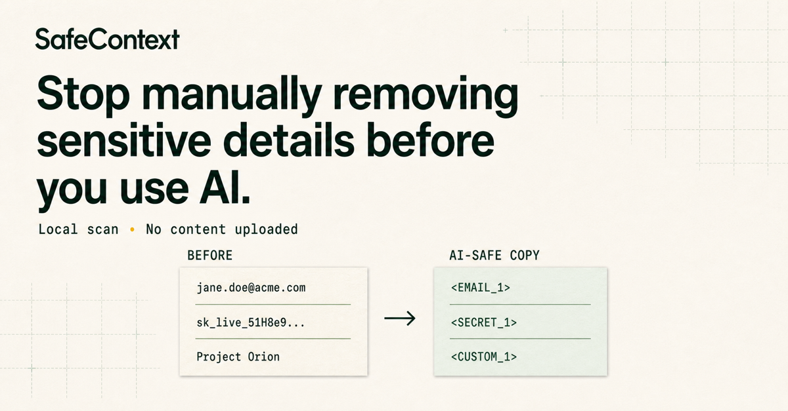

# SafeContext



[](https://www.skills.sh/kuhung/safectx/make-ai-safe-copy)

**Keep the useful context. Remove what should stay private.**

SafeContext is testing one moment: you have useful work text for ChatGPT,
Claude, Copilot, or Codex, but part of it should not leave your device.

The browser demo runs locally, shows every replacement, and never uploads the
text. Choose the task closest to your real work:

- [Client report](https://safectx-ai-privacy.dainty-nova-4389.chatgpt.site/?utm_source=github&utm_medium=repository&utm_campaign=launch-v3-scene-evidence&utm_content=readme-client-report&variant=scene_outcome&scene=client_report)
- [Support ticket](https://safectx-ai-privacy.dainty-nova-4389.chatgpt.site/?utm_source=github&utm_medium=repository&utm_campaign=launch-v3-scene-evidence&utm_content=readme-support-ticket&variant=scene_outcome&scene=support_ticket)
- [Error log](https://safectx-ai-privacy.dainty-nova-4389.chatgpt.site/?utm_source=github&utm_medium=repository&utm_campaign=launch-v3-scene-evidence&utm_content=readme-error-log&variant=scene_outcome&scene=error_log)

This is a market test, not a claim that redaction makes confidential work safe
or compliant. We are measuring edited-input completion, cleaned-copy reuse, the
current workaround, and real next commitments—not page traffic alone.

## What stays local

- Source text and files
- Detected values
- Custom company and project terms
- The private placeholder mapping

The browser scanner and packaged agent workflow make no network requests for
detection. Originals are never silently modified.

## Agent package

The repository also contains the 0.3.0 local agent workflow for synthetic or
already-public files. It creates a separate `.ai-safe/` copy with stable
placeholders.

Supported package formats:

- `.codex-plugin/plugin.json` for Codex
- `.claude-plugin/plugin.json` for Claude Code
- `gemini-extension.json` for Gemini CLI
- `skills/make-ai-safe-copy/SKILL.md` as the shared workflow

Try the CLI only with synthetic or already-public content:

```bash
node skills/make-ai-safe-copy/scripts/safectx.mjs sanitize \
  --out-dir .ai-safe \
  --term "Example Project" \
  ./example
```

Agent Skills CLI:

```bash
npx skills add https://github.com/kuhung/safectx --skill make-ai-safe-copy
```

Codex CLI:

```bash
codex plugin marketplace add kuhung/safectx --ref main
codex plugin add safectx@safectx
```

Claude Code:

```bash
claude plugin marketplace add kuhung/safectx
claude plugin install safectx@safectx
```

Gemini CLI:

```bash
gemini extensions install kuhung/safectx --ref v0.3.0
```

## Capability boundary

SafeContext reduces accidental exposure. It does not detect every confidential
fact, make a document safe, provide a compliance guarantee, or replace an
approved enterprise AI, DLP, or human review.

## Help test the actual workflow

Please describe the last real task and your current workaround, but never paste
real secrets, customer data, internal names, document excerpts, screenshots, or
private logs.

- [Compare the three scenes and share your workaround](https://github.com/kuhung/safectx/issues/1)
- [Report a missed sensitive category](https://github.com/kuhung/safectx/issues/new?template=missed-detection.yml)
- [Report an incorrect replacement](https://github.com/kuhung/safectx/issues/new?template=false-positive.yml)
- [Share workflow feedback](https://github.com/kuhung/safectx/issues/new?template=workflow-feedback.yml)

## Development

Requires Node.js 22 or newer.

```bash
npm test
```

Security and privacy reports: use the
[SafeContext contact form](https://safectx-ai-privacy.dainty-nova-4389.chatgpt.site/contact).
